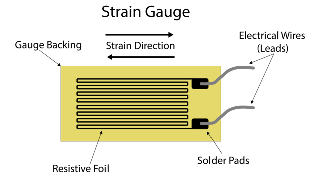
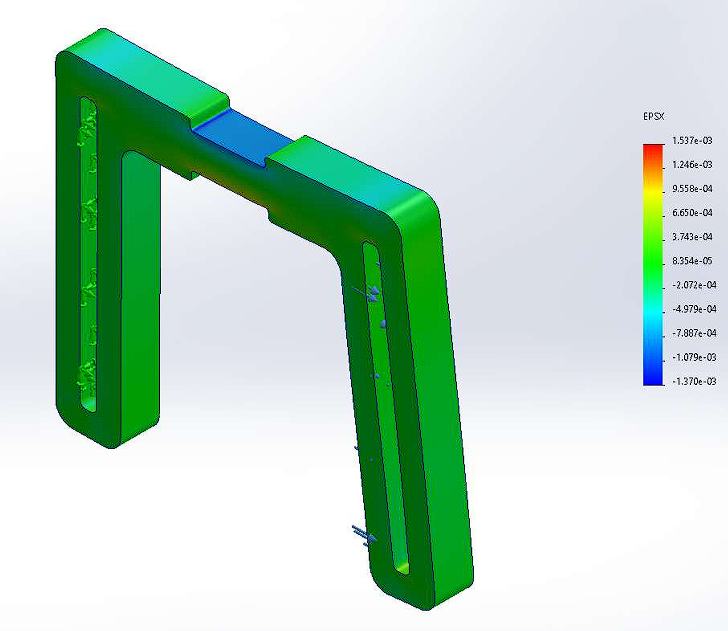
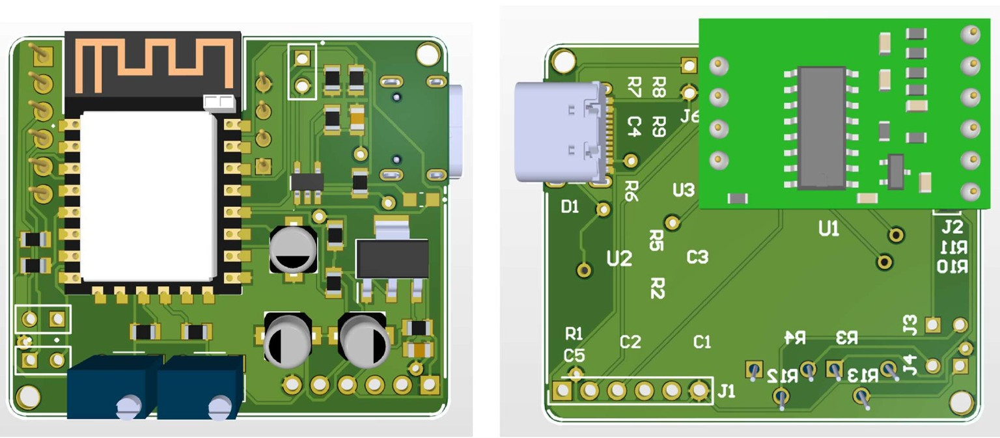

# Fitness Rubber Band Monitoring System

## Overview
The **Fitness Rubber Band Monitoring System** is an wearable device designed to track and analyze resistance band exercises. Using **strain gauge sensors** integrated into the rubber band, the system detects resistance variations during stretching, providing **real-time feedback on workout intensity**. The data is processed using a **Wheatstone bridge circuit and an Arduino-based microcontroller**, ensuring accurate monitoring and performance analysis.

## Features
- **Real-time resistance tracking** using strain gauge sensors.
- **Wheatstone bridge circuit** for precise resistance variation measurement.
- **Differential amplifier** for signal amplification.
- **Automatic calibration system (software)** to correct initial state errors.
- **OLED display output** for live workout data.
- **Battery-powered for portability.**

## Hardware Components
- **Strain Gauge Sensors** 
- **hx711** (Amplifier + ADC)
- **ESP8266 Microcontroller** (to process data and display results)
- **OLED Display**
- **Wheatstone Bridge Circuit** (for accurate strain measurement)
- **Power Supply** (3.7 Lipo battery or USB power source)

## Sensitivity Calculations

.

- **Resistance**: 350 +/- 0.1 Ω
- **Gauge factor**: 2.0-2.20
- **Size**: 7.0mm * 4.5mm
- **Accuracy rating**: +/- 3%
- **Strain limit**: 2.0%
- **Applicable temperature**: normal temperature ( -30°C to 60°C)
- **Maximum resistance change**: 2 x 2% = 4%

## Loadcell

To get the improved sensitivity we have used 4 strain guages and placement of strain gauges and strain levels we would obtain within applied force levels were determined by conducting a solidworks analysis. You can find analysis report inside loadcell directory.

.

## Circuit Design
The system consists of the following key components:
1. **Wheatstone Bridge Circuit:** Measures the strain-induced resistance variation.
2. **Differential Amplifier:** Amplifies the small resistance changes detected.
5. **Microcontroller :** Reads sensor data, applies necessary corrections, and displays results.
6. **OLED Display:** Shows real-time resistance values and alerts users.

. 

## Software Requirements
- **Arduino IDE** (for programming the microcontroller)
- **Open-source libraries** (for OLDE interfacing and hx711 ADC)
- **Python (optional)** for post-processing data visualization

## Results & Performance
- **Successfully detects strain variations** with high accuracy.
- **Comparison of simulation and prototype results** shows consistency in data.
- **Usable for strength training and rehabilitation monitoring.**

## Demo

. 

## Future Improvements
- **Connectivity** for mobile app integration.
- **Machine learning-based workout recommendations.**
- **Compact PCB version for commercial use.**

## Contributors
- **M.M.H.N.B. Marasinghe** (University of Moratuwa)
- **G.D.K. Dewagiri** (University of Moratuwa)

## License
This project is open-source and can be freely used for research and educational purposes.
